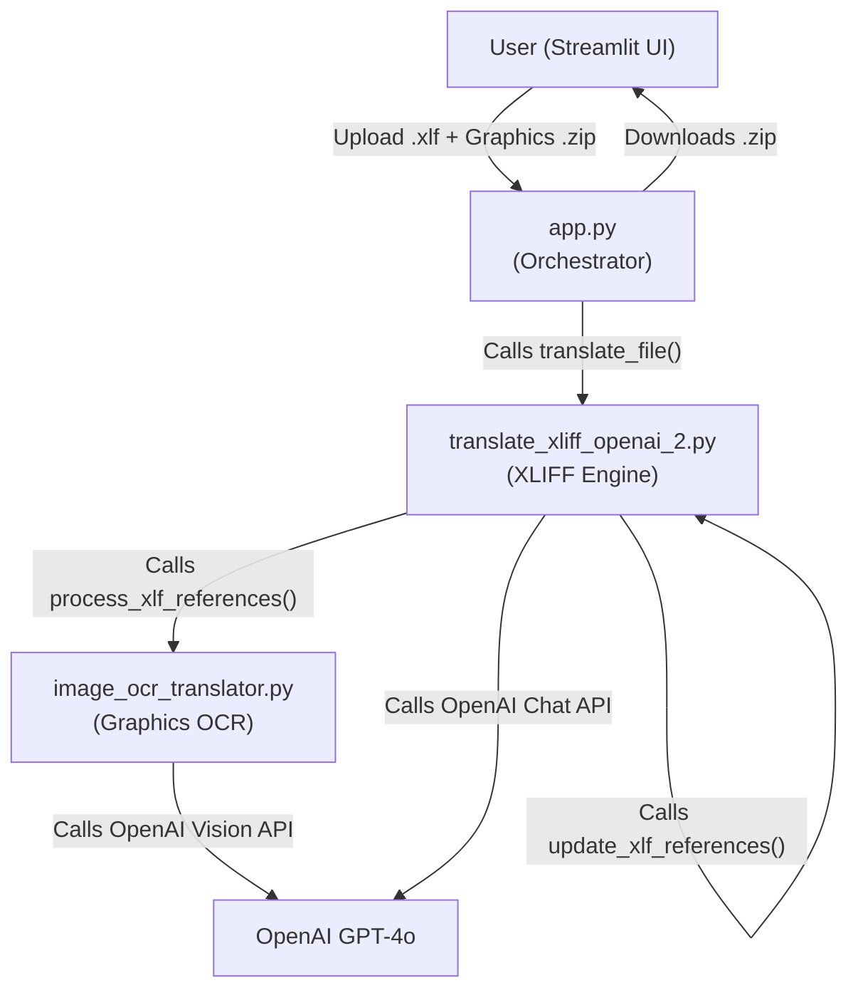
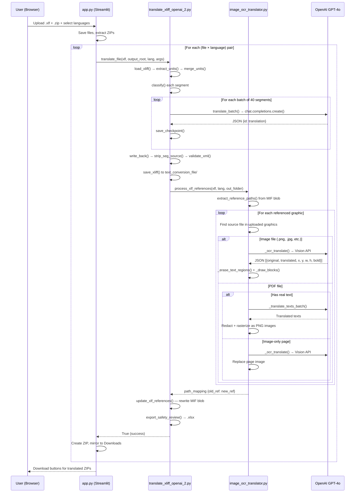

# FrameMaker XLIFF & Graphics Translation Pipeline — Codebase Deep Dive

> [!NOTE]
> This document provides a **line-by-line, function-by-function** analysis of every file in the repository. No source code was modified.

---

## Table of Contents

1. [Project Overview & Architecture](#1-project-overview--architecture)
2. [File-by-File Analysis](#2-file-by-file-analysis)
   - [`.gitignore`](#21-gitignore)
   - [`requirements.txt`](#22-requirementstxt)
   - [`render.yaml`](#23-renderyaml)
   - [`Dockerfile`](#24-dockerfile)
   - [`README.md`](#25-readmemd)
   - [`app.py` — Streamlit Frontend & Orchestrator](#26-apppy--streamlit-frontend--orchestrator)
   - [`translate_xliff_openai_2.py` — Core XLIFF Translation Engine](#27-translate_xliff_openai_2py--core-xliff-translation-engine)
   - [`image_ocr_translator.py` — Graphics OCR & Translation Engine](#28-image_ocr_translatorpy--graphics-ocr--translation-engine)
   - [`50128856_C_032019_en_Title.mifml.xlf` — Sample XLIFF](#29-sample-xliff-file)
3. [Data Flow Diagram](#3-data-flow-diagram)
4. [Key Design Decisions](#4-key-design-decisions)

---

## 1. Project Overview & Architecture

This is an **AI-powered translation pipeline** specifically designed for **Adobe FrameMaker** documents exported to XLIFF format (`.xlf`/`.xliff`). It:

1. Parses XLIFF XML, extracts translatable text segments, and batch-translates them via the **OpenAI GPT-4o** API.
2. Scans referenced graphics (images & PDFs) embedded inside the XLIFF's internal MIF binary blob, locates them inside an uploaded ZIP, performs **OCR + translation**, and overwrites text in-place.
3. Rewrites internal FrameMaker path references so that the translated document can find its translated graphics on disk.
4. Delivers everything as a ZIP archive with a specific nested folder structure that preserves FrameMaker's relative path resolution.



---

## 2. File-by-File Analysis

---

### 2.1 [.gitignore](file:///d:/Extra/language_translation/.gitignore)

**Purpose**: Standard Python `.gitignore` with project-specific exclusions.

| Pattern | Why |
|---|---|
| `.venv/`, `venv/`, `ENV/` | Virtual environment directories |
| `__pycache__/`, `*.py[cod]`, `*$py.class` | Python bytecode cache |
| `.env` | Secrets file (OpenAI key, API token) |
| `uploads/`, `output/`, `workspaces/` | Runtime-generated directories |
| `*.checkpoint.json` | Translation checkpoint files (resumable jobs) |
| `*.xlsx` | Generated safety review spreadsheets |

---

### 2.2 [requirements.txt](file:///d:/Extra/language_translation/requirements.txt)

**Purpose**: Python dependencies for the entire project.

| Package | Role |
|---|---|
| `openai>=1.0.0` | OpenAI API client for GPT-4o (text + vision) |
| `lxml>=4.9.0` | XML parsing/manipulation for XLIFF documents |
| `openpyxl>=3.1.0` | Excel export for safety review spreadsheets |
| `PyMuPDF>=1.24.0` | PDF reading, text extraction, redaction, and image insertion (`fitz`) |
| `Pillow>=10.0.0` | Image manipulation (load, draw text, erase regions) |
| `numpy>=1.26.0` | Numerical operations for color sampling and inpainting masks |
| `langdetect>=1.0.9` | Automatic language detection to skip already-translated content |
| `opencv-python-headless>=4.10.0` | OpenCV for intelligent text inpainting (Telea algorithm) |
| `python-dotenv==1.1.1` | `.env` file loading |
| `streamlit>=1.30.0` | Web UI framework |

---

### 2.3 [render.yaml](file:///d:/Extra/language_translation/render.yaml)

**Purpose**: Render.com deployment configuration (Infrastructure-as-Code).

```yaml
services:
  - type: web
    name: language-translation-api
    runtime: python
    buildCommand: pip install -r requirements.txt
    startCommand: streamlit run app.py --server.port $PORT --server.address 0.0.0.0
    envVars:
      - key: OPENAI_API_KEY
        sync: false   # Must be set manually in Render dashboard
```

> [!IMPORTANT]
> The `render.yaml` deploys the **Streamlit** app directly (not FastAPI). The `startCommand` runs `streamlit run app.py`.

---

### 2.4 [Dockerfile](file:///d:/Extra/language_translation/Dockerfile)

**Purpose**: Docker containerization for production deployment.

| Layer | What it does |
|---|---|
| `FROM python:3.10-slim` | Lightweight Python 3.10 base |
| `RUN apt-get ... git` | Installs `git` so the app can query commit hashes at runtime |
| `ENV PYTHONDONTWRITEBYTECODE=1` | Prevents `.pyc` file generation |
| `ENV PYTHONUNBUFFERED=1` | Forces unbuffered stdout/stderr for real-time logging |
| `COPY requirements.txt` → `RUN pip install` | Leverages Docker layer caching for faster rebuilds |
| `COPY . /app/` | Copies all source code |
| `EXPOSE 8000` | Declares the port |
| `CMD ["streamlit", "run", "app.py", ...]` | Entry point runs the Streamlit app |

> [!NOTE]
> OpenCV/PyMuPDF system dependency installation lines (lines 16-21) are **commented out** — the headless variants (`opencv-python-headless`, `PyMuPDF`) don't need system libraries.

---

### 2.5 [README.md](file:///d:/Extra/language_translation/README.md)

**Purpose**: Comprehensive project documentation covering architecture, path resolution logic, deployment guides, and technical workarounds. Key sections:

- **Architecture Overview** — describes the 4 components (FastAPI, XLIFF engine, OCR engine, Streamlit)
- **Deliverable Directory Structure** — explains the double-nested ZIP layout for FrameMaker path compatibility
- **Path Resolution Logic** — how `../Graphics/Graphics/Logo.pdf` references resolve correctly
- **Key Technical Features** — CP437 encoding fixes, NFC normalization, `.pd` bug workaround, resilient copy fallback

---

### 2.6 [app.py](file:///d:/Extra/language_translation/app.py) — Streamlit Frontend & Orchestrator

**Purpose**: The **main entry point**. A Streamlit web application that provides a drag-and-drop UI for uploading XLIFF files and graphics ZIPs, selecting target languages, and downloading translated output.

#### Imports & Setup (Lines 1–23)

```python
from image_ocr_translator import process_xlf_references
from translate_xliff_openai_2 import translate_file as run_translation, MODEL as DEFAULT_MODEL, LANGUAGES
```

- Creates `uploads/` and `output/` directories on startup
- Loads environment variables from `.env`

#### Functions

---

##### [get_downloads_dir()](file:///d:/Extra/language_translation/app.py#L25-L32)

```
() → Path
```

Returns the user's local Downloads folder path. Tries `USERPROFILE` env var first, then `Path.home()`, and falls back to a hardcoded Windows path. Used to **mirror** translated ZIP files to the user's Downloads folder for convenience (local development only).

---

##### [process_language()](file:///d:/Extra/language_translation/app.py#L34-L112)

```
(target_lang, job_id, xlf_path, graphics_src_dir, xlf_name_without_ext) → (success: bool, lang: str, zip_path: Path|None, _: None)
```

**The core worker function**, called in parallel via `ThreadPoolExecutor`. For one (xlf_file, language) pair:

1. Creates an output directory: `output/{job_id}/translated_{lang}_{xlf_name}/`
2. Builds an `argparse.Namespace` with `resume=False`, `batch_size=40`, `dry_run=False`, and the graphics source folder
3. Calls [run_translation()](file:///d:/Extra/language_translation/translate_xliff_openai_2.py#L997) — the main translation pipeline
4. On success, creates a ZIP archive with a specific structure:
   - Archives each file under `{output_root.name}/{relative_path}` preserving folder hierarchy
5. **Unzips on the server** and creates a double-nested directory (`zip_name/zip_name/`) with copied `graphics/` and `text_conversion_file/` subdirectories — this enables FrameMaker's `../` relative path resolution
6. **Mirrors** the ZIP and unzipped folder to the user's local Downloads directory (silent failure if unavailable)
7. Returns a tuple of `(success, language_code, zip_path, None)`

> [!IMPORTANT]
> The `noop_progress` callback (line 45-46) discards progress updates — the Streamlit UI uses its own progress tracking outside this function.

---

##### [main()](file:///d:/Extra/language_translation/app.py#L114-L364)

The Streamlit application entry point. Key sections:

**UI Layout (Lines 116-234)**:
- Sets page config with "FrameMaker Translation Studio" title
- Injects custom CSS via `st.markdown(unsafe_allow_html=True)`:
  - Dark background (`#080a11`), Inter/Outfit fonts, gradient title, glassmorphism cards
- Renders file uploaders for XLIFF and ZIP files
- Multiselect for target languages (pulled from `LANGUAGES` dict)
- Slider for parallel worker count (1-5, default 2)
- Primary "Translate & Process Graphics" button

**Download Area (Lines 236-257)**:
- `render_downloads()` — renders download buttons from `st.session_state.downloads` list
- Each download entry has: label, path, file_name, mime type, unique key

**Processing Logic (Lines 260-361)**:
1. Validates inputs (files + languages required)
2. Generates a unique `job_id` (8-char hex)
3. Saves uploaded files to `uploads/{job_id}/`
4. Extracts all graphics ZIPs into a shared `graphics_src/` directory
5. Builds a task list: `(lang, job_id, xlf_path, graphics_dir, xlf_name)` for each (file × language) combo
6. Runs tasks in parallel using `ThreadPoolExecutor(max_workers=min(slider, num_tasks))`
7. Tracks progress with `st.progress()` bar and estimated time remaining
8. Appends successful results to `st.session_state.downloads`
9. Cleans up session upload and output directories
10. Shows success/warning message and triggers `st.balloons()` on full success

---

### 2.7 [translate_xliff_openai_2.py](file:///d:/Extra/language_translation/translate_xliff_openai_2.py) — Core XLIFF Translation Engine

**Purpose**: The heart of the pipeline. Parses XLIFF XML, classifies segments, batch-translates via OpenAI, writes translations back into the XML tree, and handles checkpoint/resume, safety review export, and MIF blob path rewriting.

**1,306 lines** — the largest file in the codebase.

#### Constants & Configuration (Lines 1–213)

| Constant | Value | Purpose |
|---|---|---|
| `MODEL` | `"gpt-4o"` | OpenAI model for translation |
| `MAX_TOKENS` | `8096` | Max response tokens per API call |
| `BATCH_SIZE` | `40` | Segments per batch API call |
| `BATCH_DELAY` | `0.5` | Seconds between batch calls (rate limiting) |
| `LANGUAGES` | dict of 20 languages | `"zh-CN"` → `"Simplified Chinese (简体中文)"`, etc. |
| `FM_LANG` | identity map | Maps language codes to themselves for FrameMaker headers |
| `DO_NOT_TRANSLATE` | set of ~24 strings | Technical codes like `"SYSTEM OK"`, `"RS-485"` that must never be translated |
| `SAFETY_STYLES` | set of ~16 style names | FrameMaker paragraph styles indicating safety-critical content |
| `SAFETY_RE` | regex | Matches segments starting with Warning/Caution/Important/Note/Danger |
| `GLOSSARY` | dict[lang → dict[en → translated]] | Per-language glossary for consistent terminology (13 languages covered) |
| `XML_NS`, `XML_LANG`, `XML_SPC` | XML namespace constants | For manipulating `xml:lang` and `xml:space` attributes |

#### Functions

---

##### [select_language_interactive()](file:///d:/Extra/language_translation/translate_xliff_openai_2.py#L61-L98)

```
() → str (language code)
```

CLI-only interactive language picker. Displays a numbered table of all 20 languages. Accepts input by number, code, or partial name match. Used only in standalone CLI mode.

---

##### [ask_path()](file:///d:/Extra/language_translation/translate_xliff_openai_2.py#L100-L111)

```
(prompt, must_exist=True, is_file=True) → Path
```

CLI helper that repeatedly prompts the user for a file/directory path until a valid one is entered. Strips quotes, expands `~`, resolves to absolute path.

---

##### [detect_ns()](file:///d:/Extra/language_translation/translate_xliff_openai_2.py#L215-L218)

```
(root: etree.Element) → str
```

Detects the XML namespace of the XLIFF root element. Extracts from the tag's `{namespace}` prefix or falls back to the `xmlns` attribute.

---

##### [Q()](file:///d:/Extra/language_translation/translate_xliff_openai_2.py#L220)

```
(tag: str, ns: str) → str
```

Namespace-qualified tag helper. Returns `{ns}tag` if namespace exists, else bare `tag`.

---

##### [load_xliff()](file:///d:/Extra/language_translation/translate_xliff_openai_2.py#L222-L228)

```
(path: str) → (tree, root, ns)
```

Parses an XLIFF file with `lxml`. Uses `recover=True` for fault-tolerant parsing and `remove_blank_text=False` to preserve original formatting. Returns the tree, root element, and detected namespace.

---

##### [_style_from_group()](file:///d:/Extra/language_translation/translate_xliff_openai_2.py#L230-L238)

```
(tu: etree.Element, ns: str) → str
```

Walks up the XML tree from a `<trans-unit>` to find the nearest `<group>` ancestor's `resname` attribute. This `resname` typically contains the FrameMaker paragraph style (e.g., "Warning", "CautionTitle") which is crucial for safety classification.

---

##### [_inner_text()](file:///d:/Extra/language_translation/translate_xliff_openai_2.py#L240-L242)

```
(el: etree.Element|None) → str
```

Extracts plain text from an XML element by stripping all tags via regex. Returns the stripped text content.

---

##### [extract_units()](file:///d:/Extra/language_translation/translate_xliff_openai_2.py#L244-L287)

```
(root, ns) → list[dict]
```

**Core extraction function**. Iterates all `<trans-unit>` elements and extracts translatable segments. Handles two XLIFF segment models:

1. **`<seg-source>` + `<mrk mtype="seg">`** — XLIFF 1.2 segmentation: each `<mrk>` is a separate segment with its own `mid`
2. **Plain `<source>`** — single segment per trans-unit

Each unit dict contains: `id`, `tu_id`, `mrk_mid`, `element`, `seg_src_el`, `source` (text), `style`, `restype`.

---

##### [merge_units()](file:///d:/Extra/language_translation/translate_xliff_openai_2.py#L320-L381)

```
(units: list[dict]) → list[dict]
```

**Three-pass merging algorithm** to combine fragmented segments:

1. **Pass 1**: Merges small fragments (≤3 chars, or pure symbols/numbers) within the same `tu_id`
2. **Pass 2**: Merges unit fragments (empty, pure number/symbol/temperature) with adjacent segments
3. **Pass 3**: Merges bare page numbers (e.g., `"25"`) into preceding segments that end with "page", "figure", "table", etc.

Uses helper functions:
- `_is_unit_fragment()` — detects empty, temperature unit, or pure symbol fragments
- `_is_page_number_suffix()` — detects if a number follows a page/figure reference

---

##### [classify()](file:///d:/Extra/language_translation/translate_xliff_openai_2.py#L383-L413)

```
(unit: dict) → "skip" | "safety" | "body"
```

Classifies each segment into one of three categories:

| Classification | Criteria |
|---|---|
| `"skip"` | Empty, pure numeric/symbol, URL, single non-alpha char, or in `DO_NOT_TRANSLATE` set |
| `"safety"` | Style matches `SAFETY_STYLES` or text matches `SAFETY_RE` pattern |
| `"body"` | Everything else (standard translatable content) |

> [!TIP]
> Mixed content with both digits and letters (e.g., temperature ranges like "-20°C to +60°C") is classified as `"body"` and translated, preserving the numeric values.

---

##### [build_sys()](file:///d:/Extra/language_translation/translate_xliff_openai_2.py#L429-L434)

```
(target_lang: str) → str
```

Builds the GPT-4o **system prompt** by interpolating:
- Full language name
- First 12 "do not translate" terms
- First 12 glossary entries for the target language
- Rules for safety segments, temperature preservation, pure numbers, JSON-only output

---

##### [translate_batch()](file:///d:/Extra/language_translation/translate_xliff_openai_2.py#L437-L485)

```
(batch: list[dict], target_lang, sys_prompt, dry_run, model_to_use) → dict[id → translation]
```

Translates a batch of segments via the OpenAI API:

1. In `dry_run` mode, returns `"[DRY RUN] {source[:50]}"` for each segment
2. Builds a JSON payload mapping segment IDs to source text (safety segments get `[SAFETY]` prefix)
3. Calls `client.chat.completions.create()` with `response_format={"type": "json_object"}`
4. Parses the JSON response, stripping markdown code fences if present
5. **Retry logic**: 3 attempts with exponential backoff. Rate limit errors (429) get 30s × attempt wait. On final failure, returns original source text as fallback.

---

##### [strip_seg_source()](file:///d:/Extra/language_translation/translate_xliff_openai_2.py#L488-L503)

```
(root, ns) → int (removed count)
```

Removes all `<seg-source>` elements from the XML tree. This is an **XLIFF 1.2 schema fix** — `<seg-source>` is not valid in the output and must be stripped after translations are written into `<target>` elements. Preserves tail text by reattaching it to the previous sibling or parent.

---

##### [_inject_translation_into_source_clone()](file:///d:/Extra/language_translation/translate_xliff_openai_2.py#L506-L600)

```
(tgt: etree.Element, seg_el: etree.Element, mid_map: dict, tag_mrk, tag_g) → None
```

**Complex XML manipulation function** that populates a `<target>` element (cloned from `<source>`) with translated text. Handles several edge cases:

1. **No children** — sets `tgt.text` directly
2. **All children have `translate="no"`** — places text in `tgt.text` or child tails
3. **Content in `tgt.text`** — replaces text, clears children's text/tails
4. **Content in child tails** — finds the first child with significant tail text and replaces it
5. **Content in translatable child text** — replaces the first translatable child's text

---

##### [write_back()](file:///d:/Extra/language_translation/translate_xliff_openai_2.py#L602-L710)

```
(units, translations, ns, target_lang) → int (updated count)
```

Writes translations back into the XLIFF tree. Groups units by `tu_id`, then for each trans-unit:

1. Removes any existing `<target>` elements
2. **Seg-source path**: Builds a `mid_map` of `{mrk_mid: translated_text}`, deep-copies `<source>` to create `<target>`, calls `_inject_translation_into_source_clone()`
3. **Plain path**: Deep-copies `<source>`, sets translated text using the same child-aware placement logic
4. Sets `xml:lang` and `state="translated"` on every `<target>`
5. Inserts `<target>` immediately after `<source>` in the tree

---

##### [validate_xml()](file:///d:/Extra/language_translation/translate_xliff_openai_2.py#L712-L720)

```
(tree) → bool
```

Round-trip validation: serializes the tree to string, re-parses it, and checks for `XMLSyntaxError`. Ensures the output is well-formed XML.

---

##### [set_header_lang()](file:///d:/Extra/language_translation/translate_xliff_openai_2.py#L722-L726)

```
(root, ns, target_lang) → None
```

Sets `target-language` attribute on all `<file>` elements in the XLIFF header.

---

##### [save_xliff()](file:///d:/Extra/language_translation/translate_xliff_openai_2.py#L728-L731)

```
(tree, path) → None
```

Writes the XML tree to disk with UTF-8 encoding, XML declaration, and pretty printing. Creates parent directories if needed.

---

##### [export_safety_review()](file:///d:/Extra/language_translation/translate_xliff_openai_2.py#L733-L759)

```
(units, translations, path) → None
```

Generates an Excel spreadsheet (`.xlsx`) for human review of safety-critical translations. Columns: ID, Style, English, Translation, Reviewer Notes. Styled with dark blue headers and warm-toned data rows.

---

##### [load_checkpoint() / save_checkpoint()](file:///d:/Extra/language_translation/translate_xliff_openai_2.py#L761-L771)

```
load_checkpoint(path) → dict
save_checkpoint(path, data) → None
```

JSON-based checkpoint system for **resumable translation jobs**. Saves `{segment_id: translated_text}` after each batch. On resume, already-translated segments are skipped.

---

##### [_basename_of_mif_value()](file:///d:/Extra/language_translation/translate_xliff_openai_2.py#L781-L786)

```
(raw: str) → str
```

Extracts the filename from a MIF-encoded path. HTML-unescapes the value, replaces MIF path separators (`<u>`, `<c>`, `\`, `:`) with `/`, and returns the last path component.

---

##### [_rewrite_mif_blob()](file:///d:/Extra/language_translation/translate_xliff_openai_2.py#L789-L832)

```
(mif: str, path_mapping: dict) → (new_mif: str, count: int)
```

Regex-based rewriter for `<ImportObFile>` entries inside the MIF blob. Tries exact match first, then basename match. Logs matched/unmatched samples for debugging.

---

##### [_to_mif_path()](file:///d:/Extra/language_translation/translate_xliff_openai_2.py#L842-L852)

```
(path_str: str) → str
```

Converts a filesystem path to MIF encoding: `..` → `<u>`, directory names → `<c>name`. HTML-escapes the result.

---

##### [_reencode_mif_to_blob()](file:///d:/Extra/language_translation/translate_xliff_openai_2.py#L854-L858)

```
(mif: str, original_was_gzipped: bool) → str (base64)
```

Re-encodes a MIF string back to a base64 blob, optionally gzip-compressing first.

---

##### [update_xlf_references()](file:///d:/Extra/language_translation/translate_xliff_openai_2.py#L861-L994)

```
(xlf_path, path_mapping: dict) → None
```

**The path rewriting engine**. This is critical for making FrameMaker find translated graphics:

1. Parses the XLIFF, finds the `<internal-file>` element containing the MIF blob
2. Base64-decodes and optionally gzip-decompresses the blob
3. Iterates all `<ImportObFileDI>` entries (device-independent paths)
4. For each, tries to match the filename against `path_mapping` using multiple strategies: exact, lowercase, basename, converted path
5. When matched, rewrites **both** the `<ImportObFileDI>` content (MIF-encoded) and the corresponding `<ImportObFile>` content (plain path)
6. Re-encodes, re-compresses, and saves the updated XLIFF

---

##### [translate_file()](file:///d:/Extra/language_translation/translate_xliff_openai_2.py#L997-L1154)

```
(input_path, output_root, target_lang, args, model_to_use, progress_callback=None) → bool
```

**The main orchestrator function**, called by `app.py`. Full pipeline:

1. Creates output directory structure: `output_root/text_conversion_file/`
2. Loads and parses the XLIFF
3. Extracts and merges segments
4. Classifies each segment (skip/safety/body)
5. Optionally resumes from checkpoint
6. Batch-translates segments (with progress callbacks)
7. Writes translations back into the XML tree
8. Strips `<seg-source>` elements
9. Validates XML well-formedness
10. Saves the translated XLIFF to `text_conversion_file/`
11. Calls `process_xlf_references()` from `image_ocr_translator.py` for graphics OCR
12. Calls `update_xlf_references()` to rewrite MIF blob paths
13. Exports safety review spreadsheet
14. Cleans up checkpoint file
15. Returns `True` on success

---

##### [run_batch()](file:///d:/Extra/language_translation/translate_xliff_openai_2.py#L1156-L1199)

```
(args, model_to_use, target_lang) → None
```

CLI batch mode: processes all `.xlf`/`.xliff` files in a folder. Reports success/failure counts.

---

##### [run_single()](file:///d:/Extra/language_translation/translate_xliff_openai_2.py#L1201-L1210)

```
(args, model_to_use, target_lang) → None
```

CLI single-file mode. Determines output path and calls `translate_file()`.

---

##### [main()](file:///d:/Extra/language_translation/translate_xliff_openai_2.py#L1212-L1306)

CLI entry point with `argparse`. Arguments: `--batch-folder`, `--graphics-source-folder`, `--output-folder`, `--target`, `--model`, `--batch-size`, `--dry-run`, `--resume`, `--verbose`. If arguments are missing, prompts interactively. After translation, creates a deliverable ZIP.

---

### 2.8 [image_ocr_translator.py](file:///d:/Extra/language_translation/image_ocr_translator.py) — Graphics OCR & Translation Engine

**Purpose**: Finds graphics referenced inside the XLIFF's embedded MIF blob, locates source files in the uploaded graphics folder, performs OCR + translation on images and PDFs, and produces translated copies. **1,366 lines**.

#### Constants & Configuration (Lines 1–76)

| Constant | Value | Purpose |
|---|---|---|
| `MODEL` | `"gpt-4o"` | OpenAI Vision model for OCR |
| `API_TIMEOUT` | `120` | Seconds timeout for API calls |
| `MAX_IMG_DIM` | `3000` | Max pixel dimension before downscaling |
| `BOX_PADDING` | `2` | Padding around text boxes |
| `MIN_FONT` / `MAX_FONT` | `7` / `96` | Font size bounds for text rendering |
| `_MIN_CHARS_FOR_LANGDETECT` | `20` | Minimum text length for language detection |
| `LANG_NAMES` | dict | Language code → English name mapping (21 languages) |
| `_LANG_ROOT` | dict | Maps variants to roots (e.g., `"zh-CN"` → `"zh-cn"`, `"nb"` → `"no"`) |
| `IMAGE_EXTENSIONS` | set | `.png`, `.jpg`, `.jpeg`, `.bmp`, `.gif`, `.tif`, `.tiff` |
| `PDF_EXTENSIONS` | set | `.pdf` |

#### Helper Functions

---

##### [_lang_root()](file:///d:/Extra/language_translation/image_ocr_translator.py#L78-L79)

Normalizes language codes to root form for comparison (e.g., `"zh-CN"` → `"zh-cn"`).

##### [_detect_language()](file:///d:/Extra/language_translation/image_ocr_translator.py#L81-L90)

Wraps `langdetect.detect()` with a minimum character threshold and error handling.

##### [_already_in_target_language()](file:///d:/Extra/language_translation/image_ocr_translator.py#L92-L96)

Checks if text is already in the target language to avoid re-translating.

---

#### Font Management (Lines 98–199)

##### [_get_downloaded_font_path()](file:///d:/Extra/language_translation/image_ocr_translator.py#L128-L168)

```
(target_lang: str, bold: bool) → str
```

Downloads language-specific Noto fonts from GitHub on first use. Supports CJK (SC, TC, JP, KR), Arabic, and general Latin scripts. Caches downloaded fonts in `_DOWNLOADED_FONTS` dict and saves to the script's directory.

##### [_get_font()](file:///d:/Extra/language_translation/image_ocr_translator.py#L170-L199)

```
(size, bold=False, target_lang="en") → ImageFont.FreeTypeFont
```

Font resolution with priority order: downloaded Noto CJK → system CJK fonts → system fonts (Windows/Linux/macOS). Falls back to PIL default if nothing found.

---

#### Image Processing Utilities (Lines 201–647)

##### [_encode_pil()](file:///d:/Extra/language_translation/image_ocr_translator.py#L201-L204) / [_cap_image()](file:///d:/Extra/language_translation/image_ocr_translator.py#L206-L214)

Encode PIL image to base64 PNG / downscale to `MAX_IMG_DIM` preserving aspect ratio.

##### [_sample_bg_color()](file:///d:/Extra/language_translation/image_ocr_translator.py#L216-L237)

```
(img, x, y, w, h) → (R, G, B)
```

Samples pixels around the border of a text bounding box to determine the **background color**. Takes median of border pixels.

##### [_sample_text_color()](file:///d:/Extra/language_translation/image_ocr_translator.py#L239-L269)

```
(img, x, y, w, h, bg) → (R, G, B)
```

Samples pixels **inside** a text box and finds the ones most different from the background color (top 25% by Euclidean distance). Returns median of those as the **text color**. Falls back to black/white contrast if no significant difference is found.

##### [_wrap_text()](file:///d:/Extra/language_translation/image_ocr_translator.py#L271-L303)

Word-wrapping with per-character fallback for CJK/long words. Breaks text to fit within `max_w` pixels.

##### [_fits()](file:///d:/Extra/language_translation/image_ocr_translator.py#L305-L315)

Checks if wrapped text fits within a `w × h` box at a given font size.

##### [_best_font()](file:///d:/Extra/language_translation/image_ocr_translator.py#L317-L337)

**Binary search** for the largest font size that makes the text fit within the box. Starts from an initial seed size and searches between `MIN_FONT` and `min(MAX_FONT, seed*2)`.

##### [_ocr_translate()](file:///d:/Extra/language_translation/image_ocr_translator.py#L339-L388)

```
(b64_image, target_lang, img_w, img_h) → list[dict]
```

**The OCR engine**. Sends a base64-encoded image to GPT-4o Vision API with a detailed prompt asking it to:
1. Detect ALL visible text
2. Translate every piece into the target language
3. Return bounding boxes (x, y, width, height) and bold flag

Returns a JSON array of `{original, translated, x, y, width, height, bold}` blocks.

##### [_translate_texts_batch()](file:///d:/Extra/language_translation/image_ocr_translator.py#L390-L424)

```
(texts: list[str], target_lang) → list[str]
```

Batch text translation for PDF text-layer processing. Sends numbered items to GPT-4o, parses numbered responses back.

---

##### [_detect_alignment()](file:///d:/Extra/language_translation/image_ocr_translator.py#L432-L478)

```
(img, x, y, w, h, bg) → "left" | "center" | "right"
```

Pixel-level alignment detection. Samples columns across the box, determines which have text (pixels different from background), and compares left/right margins to infer alignment.

##### [_find_text_baseline()](file:///d:/Extra/language_translation/image_ocr_translator.py#L480-L505)

Scans from bottom to top to find the lowest row with text pixels — the visual baseline.

---

##### [_erase_text_regions()](file:///d:/Extra/language_translation/image_ocr_translator.py#L507-L519)

Dispatcher: tries OpenCV inpainting first, falls back to solid fill.

##### [_erase_with_inpaint()](file:///d:/Extra/language_translation/image_ocr_translator.py#L521-L553)

Creates a binary mask of text pixels (pixels differing from background by >35 distance), dilates the mask, and uses **Telea inpainting** to fill the regions smoothly.

##### [_erase_with_solid_fill()](file:///d:/Extra/language_translation/image_ocr_translator.py#L555-L561)

Simple fallback: fills text boxes with their sampled background color.

---

##### [_draw_blocks()](file:///d:/Extra/language_translation/image_ocr_translator.py#L563-L647)

```
(pil_img, blocks, target_lang) → Image
```

**The main image rendering pipeline**:
1. For each OCR block: sample bg/fg colors, detect alignment, find baseline, check bold flag
2. Erase all text regions (inpaint or solid fill)
3. For each block: find best font size via binary search, calculate vertical position from baseline, render text with correct alignment (left/center/right)

---

#### PDF Processing (Lines 649–984)

##### [_extract_pdf_text()](file:///d:/Extra/language_translation/image_ocr_translator.py#L649-L657)

Extracts up to 2000 chars of text from a PDF for language detection.

##### [_has_real_text()](file:///d:/Extra/language_translation/image_ocr_translator.py#L659-L660)

Checks if a PDF page has extractable text (vs. being a rasterized image).

##### [_get_fitz_fontname()](file:///d:/Extra/language_translation/image_ocr_translator.py#L662-L670)

Maps font names to PyMuPDF built-in font codes (Helvetica/Times variants for bold/italic combos).

##### [_find_system_font()](file:///d:/Extra/language_translation/image_ocr_translator.py#L672-L685)

Finds a system font file path, preferring downloaded Noto fonts for CJK/Arabic support.

##### [_get_page_font()](file:///d:/Extra/language_translation/image_ocr_translator.py#L687-L697)

Inserts a custom font into a PDF page for text rendering. Falls back to built-in fonts on failure.

##### [_detect_span_alignment()](file:///d:/Extra/language_translation/image_ocr_translator.py#L699-L719)

Detects text alignment (0=left, 1=center, 2=right) by comparing a text span's position within its containing block.

---

##### [_process_text_layer_page()](file:///d:/Extra/language_translation/image_ocr_translator.py#L721-L837)

```
(page: fitz.Page, target_lang) → bool
```

Processes a PDF page that has **real text** (not just images):

1. Extracts all text spans with font info and bounding boxes
2. Checks if already in target language (skip if so)
3. Batch-translates all span texts
4. Redacts original text using PyMuPDF's redaction API
5. **Rasterizes** translated text as transparent PNG images at 4× zoom and inserts them into the PDF — this bypasses FrameMaker font embedding issues
6. Adjusts position based on detected alignment (left/center/right)

> [!IMPORTANT]
> The "render text as image" approach (lines 782-835) is a deliberate workaround. PyMuPDF's `insert_text()` doesn't support CJK fonts well in all contexts, so rasterizing to PNG at 4× resolution ensures crisp rendering regardless of font availability.

---

##### [_process_image_layer_page()](file:///d:/Extra/language_translation/image_ocr_translator.py#L839-L866)

Processes a PDF page that has **no real text** (image-only, e.g., scanned diagrams):

1. Renders the page to a 2× resolution pixmap
2. Runs OCR + translation via `_ocr_translate()`
3. Draws translated text blocks onto the image
4. Replaces the page's images with the translated version

---

##### [process_image()](file:///d:/Extra/language_translation/image_ocr_translator.py#L868-L914)

```
(source_path, target_lang, out_folder, rename_with_lang) → str (output filename)
```

Top-level image translation: opens image, runs OCR, draws translated blocks, saves in original format (JPEG at quality 95, etc.). Copies unchanged if no text detected or no translation needed.

---

##### [process_pdf()](file:///d:/Extra/language_translation/image_ocr_translator.py#L916-L984)

```
(source_path, target_lang, out_folder, rename_with_lang) → str (output filename)
```

Top-level PDF translation:

1. Checks if already in target language (copy unchanged)
2. For each page: text-layer or image-layer processing
3. Preserves original crop box, media box, and rotation after modifications
4. Saves with `garbage=4, deflate=True` for compression
5. Uses atomic write (`.tmp.pdf` → rename)

---

#### MIF Blob Parsing & Reference Extraction (Lines 986–1199)

##### [_parse_mif_path()](file:///d:/Extra/language_translation/image_ocr_translator.py#L996-L1000)

Converts MIF-encoded path to filesystem path: `<u>` → `../`, `<c>` → `/`.

##### [_decode_internal_file_blob()](file:///d:/Extra/language_translation/image_ocr_translator.py#L1002-L1038)

Extracts and decodes the base64/gzip-compressed MIF blob from the XLIFF's `<internal-file>` element.

##### [extract_reference_paths()](file:///d:/Extra/language_translation/image_ocr_translator.py#L1040-L1078)

```
(xlf_path: Path) → list[(di_raw, abs_path)]
```

Parses all `<ImportObFileDI>` entries from the MIF blob, converts to filesystem paths, filters by supported media extensions, deduplicates, and returns `(raw_DI_value, absolute_path)` pairs.

##### [_update_mif_blob()](file:///d:/Extra/language_translation/image_ocr_translator.py#L1080-L1115)

Rewrites `<ImportObFile>` values inside the MIF blob text using a mapping dict.

##### [_rebuild_xlf_with_updated_paths()](file:///d:/Extra/language_translation/image_ocr_translator.py#L1117-L1171)

Full pipeline: decode blob → update paths → re-encode → save XLIFF.

##### [_subfolder_from_di()](file:///d:/Extra/language_translation/image_ocr_translator.py#L1173-L1199)

```
(di_fs_path: str) → Path
```

Extracts the subdirectory structure from a DI path, anchoring on the "Graphics" folder. Strips absolute path prefixes and common Windows user directories.

---

##### [process_xlf_references()](file:///d:/Extra/language_translation/image_ocr_translator.py#L1202-L1366)

```
(xlf_path, target_lang, out_folder, rel_prefix, rename_with_lang, out_xlf_path, src_graphics_folder, progress_callback) → dict[str, str]
```

**The main graphics orchestrator**:

1. Extracts all graphic references from the XLIFF
2. For each reference, searches the uploaded graphics folder using three strategies:
   - **Structural match**: `src_root / subfolder / filename`
   - **Direct match**: `src_root / filename`
   - **Recursive glob**: `src_root / **/ filename`
3. Processes found files with `process_image()` or `process_pdf()`
4. Builds a path mapping: `{original_reference: new_MIF_path}`
5. The MIF path follows the pattern `../{folder}/graphics/{subfolder}/{filename}` for FrameMaker compatibility
6. Returns the mapping for the caller to rewrite the XLIFF blob

---

### 2.9 Sample XLIFF File

#### [50128856_C_032019_en_Title.mifml.xlf](file:///d:/Extra/language_translation/50128856_C_032019_en_Title.mifml.xlf)

**Purpose**: A sample Adobe FrameMaker XLIFF export included in the repository for testing.

| Property | Value |
|---|---|
| Format | XLIFF 1.2 |
| Namespace | `urn:oasis:names:tc:xliff:document:1.2` |
| Source language | `en-US` |
| Datatype | `mif` (FrameMaker) |
| Original file | `TEST_01/Files/50128856_C_032019_en_Title.mifml` |
| Size | ~139 KB (mostly the base64-encoded MIF blob) |

The file contains:
- An `<internal-file>` element with a **gzip-compressed, base64-encoded MIF blob** (~135 KB). This blob contains the full FrameMaker document structure including `<ImportObFileDI>` and `<ImportObFile>` elements that reference graphics.
- Trans-units with translatable text segments

---

## 3. Data Flow Diagram



---

## 4. Key Design Decisions

### 4.1 Double-Nested ZIP Structure
The output ZIP uses `translated_{lang}/translated_{lang}/file.xlf` so that FrameMaker's `../Graphics/...` relative paths resolve correctly without rewriting the XLIFF structure.

### 4.2 MIF Blob Path Rewriting
Instead of modifying XLIFF XML paths (which FrameMaker may not honor), the pipeline decodes the **embedded MIF binary blob**, rewrites `<ImportObFileDI>` and `<ImportObFile>` entries in-place, and re-encodes.

### 4.3 Text-as-Image in PDFs
Translated text in PDFs is rendered as transparent PNG images at 4× resolution rather than using native PDF text insertion. This ensures CJK/Arabic scripts render correctly regardless of system font availability.

### 4.4 OpenCV Inpainting for Text Erasure
Before drawing translated text, original text is erased using **Telea inpainting** (OpenCV) which smoothly reconstructs the background, unlike simple solid-fill rectangles.

### 4.5 Safety Segment Classification
Segments from safety-related paragraph styles (Warning, Caution, Danger) receive special handling: a `[SAFETY]` prefix in the prompt, inclusion in the safety review spreadsheet, and maximum translation fidelity instructions.

### 4.6 Binary Search Font Sizing
When drawing translated text onto images, a binary search finds the **largest font** that makes the text fit within the original bounding box — preserving visual weight while accommodating text expansion (common when translating to CJK or German).

### 4.7 Checkpoint-Based Resumability
Translation state is saved after each batch to a `.checkpoint.json` file. If the process crashes mid-job, re-running with `--resume` skips already-translated segments.
